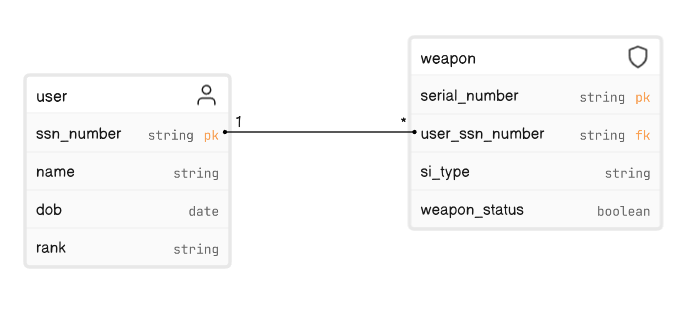

# TaskManagementSystem
## Purpose
The aim of this project was to develop a REST API for a Military Inventory System that aims to replace the current paper system.

## Schema

# Quick Start

## Create Database

Update appsettings.json with your database (database can be found in onedrive)
Update this line -> "DbConn": "Server=MASONDESKTOP\\SQLEXPRESS02;Database=inventory;Integrated Security=True;Encrypt=False"
Run as http or https
Use Postman

## OneNote (SDLC)
https://onedrive.live.com/view.aspx?resid=9A290D9121BB11E3%2129078&id=documents
